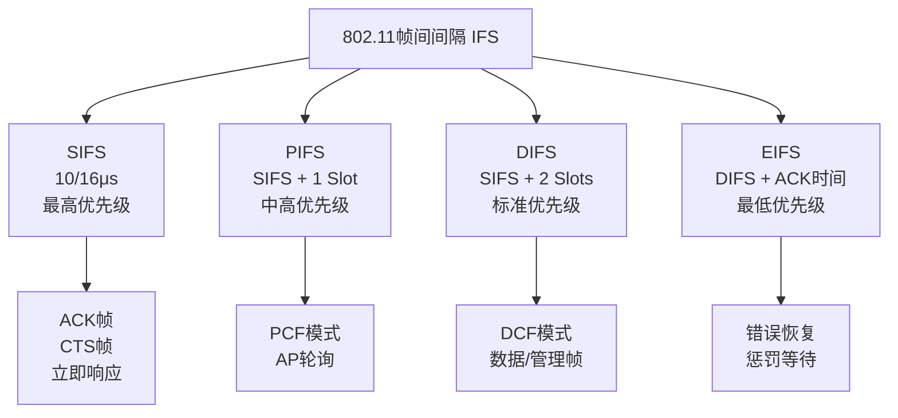
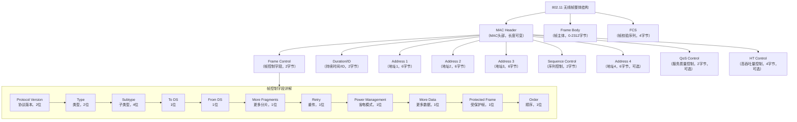
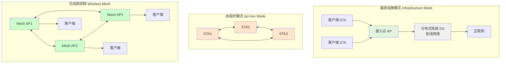
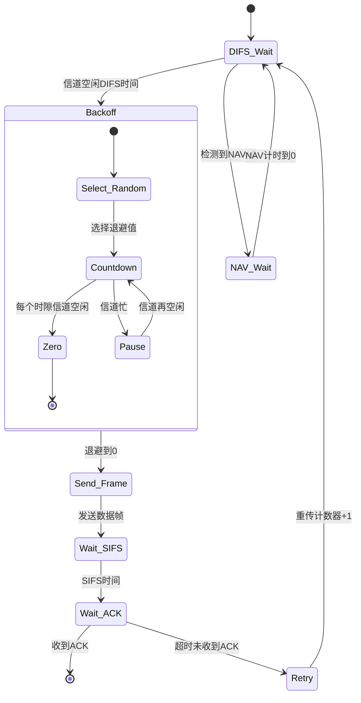

## CTS、RTS 和 ACK

好的，我们来详细解析802.11协议中的 **CTS、RTS 和 ACK** 这三种关键的控制帧。它们是Wi-Fi正常工作的基石，确保了无线通信的可靠性和效率。

### 核心概念：它们都是控制帧

在802.11中，帧主要分为三类：**数据帧**、**管理帧** 和 **控制帧**。
*   **CTS、RTS、ACK** 都属于**控制帧**。
*   它们的特点是**非常短**，传输速度快，主要作用是**为数据传输“保驾护航”**，而不是携带上层数据。

---

### 1. ACK（Acknowledgment） - 确认帧

这是最基本、最重要的一种控制帧。

*   **目的**：**确认成功接收**。每当接收方正确收到一个**单播数据帧**后，都必须立即回复一个ACK帧，告诉发送方“我已收到”。
*   **工作原理**：
    1.  发送方发送一个数据帧。
    2.  接收方校验数据正确无误后，等待一个极短的固定时间间隔（**SIFS**），然后立即发送ACK帧。
    3.  发送方如果在预定时间内收到ACK，则认为传输成功；否则，将触发重传机制。
*   **为什么重要**：
    *   **可靠性**：提供了链路层的可靠传输保障，这是无线环境（高误码率、干扰多）所必需的。
    *   **冲突检测**：在有线以太网中，设备可以边发边听来检测冲突。而在无线中，设备很难在发送时检测冲突（自己的信号会淹没其他信号），因此通过“是否收到ACK”来间接判断传输是否成功。
*   **简单比喻**：就像对话中的“收到请回复”。A对B说：“重要消息：XXX。” B必须回答：“收到。” A只有听到“收到”才放心。


---

### 2. RTS/CTS（Request to Send / Clear to Send） - 请求发送/清除发送

这是一对组合拳，**主要目的是解决“隐藏节点”问题，并减少因冲突造成的性能损失**。

#### 隐藏节点问题
假设有三个设备：A、B、C。A想发数据给B，C也想发数据给B。
*   A和C都在B的通信范围内，但**A和C互相不在对方的通信范围内**（即A听不到C，C也听不到A）。
*   当A向B发送数据时，C由于听不到A，也可能同时向B发送数据，导致在B处发生**冲突**，数据被破坏。A和C就是彼此的“隐藏节点”。

#### RTS/CTS如何工作
它通过**预留信道**来解决这个问题。过程分为四步：

1.  **RTS**：发送方（A）在发送实际数据之前，先向接收方（B）发送一个很短的**RTS帧**。RTS中包含一个**持续时间字段**，告诉其他听到此帧的设备：“我要和B通信了，预计需要占用信道XX微秒，请大家保持安静。”
2.  **CTS**：接收方（B）收到RTS后，等待SIFS，回复一个**CTS帧**。CTS帧同样包含一个持续时间字段（通常是从RTS中计算得来，覆盖剩余通信时间）。这个CTS帧有两个关键作用：
    *   对A的**应答**：“B已准备好，可以发送数据。”
    *   对**B周围所有能听到的设备**（包括隐藏节点C）**广播**：“A要发数据给我了，信道将被占用XX微秒，请大家保持安静。” **即使C听不到A的RTS，也能听到B的CTS**，从而知道需要静默。
3.  **数据传输**：A收到CTS后，等待SIFS，开始发送真正的数据帧。
4.  **ACK**：B正确接收数据后，回复ACK。

*   **为什么重要**：
    *   **解决隐藏节点**：如上所述，通过CTS让隐藏节点知晓。
    *   **减少冲突开销**：RTS和CTS帧都非常短。如果发生冲突，损失的是短小的控制帧，而不是可能很大的数据帧，从而提高了整体网络效率。
    *   **信道预留**：为后续的数据传输和ACK创造了一个无竞争的窗口。
*   **并非总是启用**：由于RTS/CTS交互本身也有开销，通常只在传输**大数据帧**（超过“RTS阈值”这个可配置参数）时启用，或者在高冲突的网络中启用。


---

### 总结对比表

| 特性 | ACK | RTS | CTS | 备注 |
| :--- | :--- | :--- | :--- | :--- |
| **全称** | Acknowledgment | Request to Send | Clear to Send | |
| **主要目的** | 确认数据帧接收成功 | 请求发送数据，预留信道 | 响应RTS，通告信道预留 | RTS/CTS成对使用 |
| **由谁发送** | 数据接收方 | 数据发送方 | 数据接收方 | |
| **发送时机** | 正确接收**单播数据帧**后 | 发送大数据帧前（如果启用） | 正确收到RTS后 | 都遵循SIFS间隔 |
| **关键字段** | — | **持续时间**（覆盖整个事务） | **持续时间**（覆盖剩余事务） | 告知其他设备NAV |
| **解决的核心问题** | 无线环境下的可靠传输与冲突检测 | **隐藏节点问题**，减少大数据帧冲突的开销 | 同RTS，并响应发送方 | ACK是必须的，RTS/CTS是可选的 |

### 高级概念：NAV（Network Allocation Vector）

要理解RTS/CTS如何让其他设备“保持安静”，就需要了解**NAV**。
*   **NAV是一个虚拟的计数器**，存在于每个802.11站点中，可以理解为**“信道忙碌倒计时器”**。
*   当站点听到任何帧（如RTS、CTS，甚至数据帧）中的**持续时间字段**时，就会根据这个值**更新自己的NAV**。
*   在NAV倒计时到零之前，站点认为信道是忙碌的，不会尝试发送数据。这就实现了**虚拟载波侦听**，与物理侦听（检测能量）共同工作。

### 完整通信流程示例（启用RTS/CTS）

假设A要向B发送一个大文件包：
```
时间线：
A:           |---RTS--->|                   |---------数据帧------->| 
             (告诉B，我要发数据了)           (在预留的信道中安全发送)
B:                     |---CTS--->|                                 |---ACK--->|
             (SIFS后)  (告诉A和周围设备：可以发，信道已预留) (SIFS后)  (确认收到)
其他设备（如C）：       听到CTS，设置NAV，保持静默...           NAV结束，恢复竞争信道。
```

总之，**ACK**是确保每次单播传输可靠性的基石；**RTS/CTS**则是在复杂无线环境中，为重要的大数据传输提前“清场”和“广播通知”的高级机制，两者协同工作，共同保障了Wi-Fi网络在共享的、充满干扰的无线介质中有序、高效地运行。


## 802.11帧间间隔

好的，我们来详细解析 **802.11帧间间隔**。它是Wi-Fi协议中**最核心、最精妙的时间控制机制**，直接决定了各种帧（数据、管理、控制）发送的优先级和顺序，是协调众多设备在共享无线信道中和谐工作的“交通信号灯”系统。

---

### 核心概念

**帧间间隔**是指802.11设备在发送不同类型的帧之前，必须等待的一段**固定时长**的静默期。
*   **目的**：为不同类型的帧分配不同的**信道访问优先级**，确保高优先级的操作（如ACK）能先于低优先级的操作（如发起新的数据传输）进行。
*   **工作原理**：当一个设备检测到信道从“忙碌”变为“空闲”时，它不能立即发送。它必须**首先等待一个特定的IFS（帧间间隔）**，然后在IFS结束后，根据竞争规则（如退避计数）来尝试发送。
*   **关键点**：**IFS越短，优先级越高**。等待时间短的帧可以“插队”，优先获得信道使用权。

### 主要帧间间隔类型（从短到长）

下图清晰地展示了不同帧间间隔的时长和它们之间的优先级关系：



#### 1. SIFS （Short Interframe Space） - 最短帧间间隔
*   **特点**：**最短的间隔，拥有最高优先级**。
*   **用途**：用于需要**立即响应**的帧序列，构成一个连续的“对话”，防止被其他设备打断。
*   **典型应用**：
    *   数据帧 → ACK帧
    *   RTS帧 → CTS帧
    *   CTS帧 → 数据帧
    *   分片数据帧 → 下一个分片
*   **时长**： 在802.11a/g/n/ac/ax中通常为 **16微秒**，在802.11b中为 **10微秒**。
*   **比喻**：就像两个人紧密对话中的停顿，对方话音刚落，你马上接话，不给第三者插嘴的机会。

#### 2. PIFS （PCF Interframe Space） - 点协调帧间间隔
*   **特点**：**中等长度，介于SIFS和DIFS之间**。
*   **用途**：专为 **PCF（点协调功能）** 模式设计。在此模式下，接入点（AP）作为“协调点”，享有比普通站点更高的优先级来轮询和控制数据传输。
*   **工作机制**：AP在PIFS结束后即可发送，而普通站点需要等待更长的DIFS，因此AP总能优先获得信道，实现无竞争的服务质量保障（如语音）。**但请注意，PCF在现实中极少被实现和部署。**
*   **时长**： `SIFS + 1 × Slot Time`。

#### 3. DIFS （DCF Interframe Space） - 分布式协调帧间间隔
*   **特点**：**标准数据帧和普通管理帧发送前必须等待的时间**。这是**DCF（分布式协调功能）** 模式下，所有设备竞争信道的基础。
*   **用途**：当设备想要**发起一个新的传输会话**（比如发送一个全新的数据包）时，它必须在信道空闲DIFS时长后，才能进入退避计数阶段。
*   **时长**： `SIFS + 2 × Slot Time`。
*   **比喻**：这是十字路口的“黄灯+全停”时间。所有车（设备）在路口变空后，都必须等完这段标准时间，然后才能根据到达顺序（退避计数）依次启动。

#### 4. EIFS （Extended Interframe Space） - 扩展帧间间隔
*   **特点**：**最长的帧间间隔，是一种惩罚性等待**。
*   **用途**：当设备**错误地接收了一个它无法解码的帧**时（例如，因为CRC校验失败，或信号太差），设备无法知道这个帧的“持续时间”字段，从而无法正确设置其NAV。为了避免在别人的传输过程中“捣乱”，它必须等待一个非常长的EIFS，之后才能尝试竞争信道。
*   **工作机制**：一旦设备成功接收到任何一个帧（即使是别人的ACK），它就可以从EIFS状态恢复到正常的DIFS状态。
*   **时长**： `SIFS + DIFS + ACK传输时间` （非常长）。
*   **比喻**：你因为没看清交通信号而误闯了红灯，被罚在路口多等一个超长的周期，确保你不会再干扰正常车流。

---

### 综合工作流程（DCF模式）

让我们结合一个完整的例子，看看IFS是如何与其他机制协同工作的：

**场景**： 设备A成功发送一个数据帧给设备B，之后设备C想要发起一个新的传输。

1.  **A的传输结束**：信道由忙变闲。
2.  **SIFS阶段**（最高优先级）：
    *   设备B等待**SIFS**后，立即回复**ACK**给A。其他所有设备（包括C）在此期间必须静默。
3.  **DIFS阶段**（标准竞争窗口）：
    *   B的ACK发送完毕，信道再次空闲。
    *   所有想要发送**新数据**的设备（如C），现在必须开始等待**DIFS**。
4.  **退避阶段**（随机竞争）：
    *   DIFS结束后，如果信道依然空闲，设备C（以及其他想发送的设备）不会立即发送，而是进入**退避阶段**。
    *   每个设备从自己的竞争窗口中选择一个**随机退避计时器**（单位为时隙）。
    *   每个时隙（Slot Time）内信道都保持空闲，计时器才减1。如果信道变忙，计时器暂停。
    *   **谁的计时器先数到零，谁就获得发送权**。设备C赢得竞争。
5.  **C开始发送**：
    *   设备C在计时器归零后，立即发送其数据帧。
6.  **循环**：
    *   接收方收到C的数据帧后，等待SIFS回复ACK...
    *   如此循环往复。

---

### 总结与重要性

1.  **严格的优先级控制**：IFS系统通过**长短不等的强制等待时间**，为ACK、控制帧、新数据等赋予了清晰的优先级，确保了协议关键机制（如确认、信道预留）的绝对优先执行。
2.  **冲突避免的核心**：DIFS + 随机退避机制，构成了DCF的基石，使得多个设备可以在没有中央控制器的情况下，以一种相对公平、分布式的方式共享信道。
3.  **效率与公平的平衡**：短SIFS保证了单次传输会话（如数据-ACK）的高效连续；长DIFS和退避机制则为不同设备提供了公平的竞争机会。
4.  **错误恢复机制**：EIFS作为一种“惩罚”机制，保护了正在进行的、但未被当前设备正确解码的传输，增强了网络的鲁棒性。

**简单记忆口诀**：**SIFS插队，DIFS排队，EIFS罚站**。这套精密的“时间信号系统”是Wi-Fi能够在复杂多变的无线环境中稳定工作的根本原因之一。


## 802.11协议帧格式

好的，我们来详细解析 **802.11协议帧格式**。理解其结构是掌握Wi-Fi工作原理的核心。

802.11帧结构非常灵活，由三个主要部分组成：**MAC Header（MAC头）**、**Frame Body（帧体）** 和 **FCS（帧校验序列）**。其中MAC头又包含多个字段，其长度和内容会根据帧类型（控制帧、管理帧、数据帧）和子类型的不同而变化。

下图展示了802.11帧的通用结构和其核心部分——MAC头部的详细布局：



---

### 各部分详解

#### 1. Frame Control（帧控制字段 - 2字节）
这是**最重要的字段**，定义了帧的基本属性。
*   **Protocol Version（协议版本，2位）**：通常为`00`。
*   **Type（类型，2位）**：定义了三大类帧：
    *   `00`：**管理帧**（Association, Beacon, Probe等）
    *   `01`：**控制帧**（RTS, CTS, ACK, PS-Poll等）
    *   `10`：**数据帧**（承载上层数据）
    *   `11`：保留
*   **Subtype（子类型，4位）**：在类型内进一步细分。例如：
    *   管理帧子类型：`1000` = Beacon，`0100` = Probe Request
    *   控制帧子类型：`1011` = RTS，`1100` = CTS，`1101` = ACK
    *   数据帧子类型：`0000` = 普通数据
*   **To DS / From DS（去往/来自分布式系统，各1位）**：
    *   **这是解读后面4个地址字段含义的关键！**
    *   它们共同指示了数据帧的流向（是去往AP？来自AP？在AP间转发？Ad-hoc直连？）。
    *   具体映射见下文“地址字段解读”。
*   **More Fragments（更多分片，1位）**：若数据被分片，除最后一片外该位均置1。
*   **Retry（重传，1位）**：若此帧是重传帧，则置1。帮助接收方处理重复帧。
*   **Power Management（电源管理，1位）**：发送方发送此帧后的电源状态。`1`表示进入省电模式，`0`表示保持活跃。
*   **More Data（更多数据，1位）**：AP用此位告知处于省电模式的客户端：AP缓存中还有更多数据等待发送给它。
*   **Protected Frame（受保护帧，1位）**：`1`表示Frame Body部分已被加密（WEP, WPA, WPA2等）。
*   **Order（顺序，1位）**：`1`表示必须严格按顺序处理此帧。

#### 2. Duration/ID（持续时间/ID - 2字节）
*   在**控制帧（RTS/CTS）** 和**数据帧**中：它携带**NAV（网络分配向量）** 值，即预计占用信道的时间（微秒），用于虚拟载波侦听，告知其他设备需要静默多久。
*   在**PS-Poll帧**中：它携带关联ID（AID），用于标识处于省电模式的客户端。

#### 3. Address Fields（地址字段 - 每个6字节）
802.11最多可包含4个地址字段（Address 1-4），其具体含义完全由 **To DS** 和 **From DS** 标志位决定。

| To DS | From DS | 地址1 (RA) | 地址2 (TA) | 地址3 | 地址4 | **常见场景** |
| :---: | :---: | :--- | :--- | :--- | :--- | :--- |
| 0 | 0 | **目的地址 (DA)** | **源地址 (SA)** | **BSSID** | 不使用 | **Ad-hoc模式**（IBSS）下，两台客户端直连。 |
| 0 | 1 | **目的地址 (DA)** | **发送端AP地址 (BSSID)** | **源地址 (SA)** | 不使用 | **来自AP的数据帧**（下行流量）。AP发给客户端。 |
| 1 | 0 | **接收端AP地址 (BSSID)** | **源地址 (SA)** | **目的地址 (DA)** | 不使用 | **去往AP的数据帧**（上行流量）。客户端发给AP。 |
| 1 | 1 | **接收端AP地址 (RA)** | **发送端AP地址 (TA)** | **目的地址 (DA)** | **源地址 (SA)** | **无线分布式系统 (WDS)** 或 Mesh 网络。帧在AP之间转发。 |

*   **RA (Receiver Address)**：该帧在**当前无线传输阶段**的**直接接收者**的MAC地址。
*   **TA (Transmitter Address)**：**当前发送此无线帧的设备**的MAC地址。
*   **DA (Destination Address)**：该帧的**最终目标**MAC地址（可能是一个有线网络上的设备）。
*   **SA (Source Address)**：产生该帧的**原始源头**MAC地址。
*   **BSSID**：基本服务集标识符，通常是AP的MAC地址。

#### 4. Sequence Control（序列控制 - 2字节）
*   **Fragment Number（分片号，4位）**：同一个MSDU（MAC服务数据单元）被分片后，每个分片的编号。
*   **Sequence Number（序列号，12位）**：每个MSDU的唯一编号（每发一个新的MSDU，序号递增）。结合分片号，用于**去重**和**重组分片**。

#### 5. Frame Body（帧体）
*   长度**0 - 2312字节**的可变字段。
*   承载实际的有效载荷：
    *   **数据帧**：承载上层（如IP层）的**数据包**。
    *   **管理帧**：承载各种**信息元素**（如Beacon帧中的SSID、支持的速率、信道等）。
    *   **控制帧**：通常为空（没有帧体），或仅有少量信息。

#### 6. FCS（Frame Check Sequence - 帧校验序列）
*   **4字节**的CRC（循环冗余校验）码。
*   接收方会重新计算FCS，并与收到的FCS比较。如果不同，则帧在传输中出错，**直接丢弃**，并可能触发重传。

---

### 三种主要帧类型格式特点

1.  **控制帧**（如ACK, RTS, CTS）：
    *   **极短**，格式最简单。
    *   通常**只有MAC头的前几个字段**（Frame Control, Duration, Address1）和FCS。
    *   **没有Frame Body**。
    *   **ACK帧**：Receiver Address（RA）就是需要确认的那个数据帧的Transmitter Address。
    *   **RTS/CTS帧**：通过Duration字段来设置NAV，预约信道。

2.  **管理帧**：
    *   具有**完整的MAC头**（通常有3个地址）。
    *   Frame Body中包含**固定字段**和一系列**信息元素**。信息元素是TLV（类型-长度-值）格式，使得帧可以灵活扩展（如支持新的安全标准、更高速度等）。

3.  **数据帧**：
    *   格式最复杂多变，取决于To DS/From DS标志。
    *   Frame Body承载网络层数据包。
    *   如果启用了加密，Frame Body是加密后的密文（Protected Frame位=1）。

### 地址字段解读示例

**场景**：手机（客户端， MAC_C）通过家用路由器（AP， MAC_AP）访问互联网服务器（MAC_S）。

1.  **上行帧（手机 -> AP）**：
    *   目标：手机发送一个IP包给服务器。
    *   **To DS=1, From DS=0**。
    *   **Address 1 (RA)**： `MAC_AP` （下一跳是AP）
    *   **Address 2 (TA)**： `MAC_C` （无线发送者是手机）
    *   **Address 3 (DA)**： `MAC_S` （最终目标是服务器）
    *   **解读**：手机通过无线告诉AP：“请把这个帧，转发给MAC_S”。

2.  **下行帧（AP -> 手机）**：
    *   目标：AP将服务器回复的IP包转发给手机。
    *   **To DS=0, From DS=1**。
    *   **Address 1 (RA)**： `MAC_C` （无线接收者是手机）
    *   **Address 2 (TA)**： `MAC_AP` （无线发送者是AP）
    *   **Address 3 (SA)**： `MAC_S` （原始来源是服务器）
    *   **解读**：AP通过无线告诉手机：“这是我收到的来自MAC_S的帧，现在发给你”。

理解802.11帧格式，尤其是地址字段和帧控制字段，是进行**无线网络排错、安全分析和性能优化**的必备基础。通过抓取和分析这些原始帧，可以洞察无线网络中发生的所有事情。


# 802.11协议完全详解

## 第一章：802.11概述

### 1.1 什么是802.11？
802.11是IEEE制定的**无线局域网（WLAN）标准系列**，俗称**Wi-Fi**。它定义了物理层（PHY）和数据链路层的MAC子层的技术规范。

### 1.2 802.11系列发展历程

| 标准 | 发布时间 | 频段 | 最大速率 | 关键技术 |
|------|----------|------|----------|----------|
| 802.11 | 1997 | 2.4GHz | 2 Mbps | 原始标准 |
| 802.11a | 1999 | 5GHz | 54 Mbps | OFDM |
| 802.11b | 1999 | 2.4GHz | 11 Mbps | DSSS |
| 802.11g | 2003 | 2.4GHz | 54 Mbps | OFDM |
| 802.11n | 2009 | 2.4/5GHz | 600 Mbps | MIMO, 40MHz信道 |
| 802.11ac | 2013 | 5GHz | 6.93 Gbps | MU-MIMO, 160MHz信道 |
| 802.11ax | 2019 | 2.4/5/6GHz | 9.6 Gbps | OFDMA, 1024-QAM |
| 802.11be | 预计2024 | 2.4/5/6GHz | 40 Gbps | 多链路操作 |

---

## 第二章：802.11工作模式

802.11网络有两种基本的拓扑结构：



### 2.1 基础设施模式（Infrastructure Mode）

#### 2.1.1 基本概念
- **AP（Access Point）**：接入点，作为无线网络的核心
- **STA（Station）**：无线终端设备
- **BSS（Basic Service Set）**：基本服务集，一个AP和关联的STA组成的网络
- **ESS（Extended Service Set）**：扩展服务集，多个BSS通过DS连接形成

#### 2.1.2 网络组成元素
```
      STA1      STA2      STA3
        │         │         │
        └─────┬───┴───┬─────┘
              │       │
            [ AP1 ] [ AP2 ]    ← BSS1, BSS2
              │       │
        ┌─────┴───────┴─────┐
        │   Distribution    │ ← DS（有线以太网）
        │     System        │
        └─────────┬─────────┘
                  │
              [ Router ]
                  │
               Internet
```

#### 2.1.3 工作流程
1. **扫描阶段**：STA主动/被动扫描寻找AP
2. **认证阶段**：身份验证（开放系统/共享密钥）
3. **关联阶段**：建立逻辑连接，分配关联ID（AID）
4. **数据传输**：通过AP转发数据

### 2.2 自组织模式（Ad-Hoc Mode / IBSS）

#### 2.2.1 特点
- **无中心架构**：STA之间直接通信
- **临时网络**：适用于会议、文件共享等场景
- **IBSS（Independent BSS）**：独立基本服务集

#### 2.2.2 工作原理
```
         STA1
        /    \
     STA2────STA3
    
    所有STA在同一个对等网络中
    需要周期性发送Beacon帧维持同步
```

### 2.3 无线分布式系统（WDS）

#### 2.3.1 概念
- 用于连接多个AP，扩展覆盖范围
- **无线桥接**：AP间通过无线连接
- **无线中继**：扩展信号范围

#### 2.3.2 工作模式
```
    模式1：点对点桥接
    [AP1] <------> [AP2]
    
    模式2：点对多点桥接
          [AP1]
         /     \
      [AP2]   [AP3]
      
    模式3：无线中继
    [Root AP] <-> [Repeater AP] <-> [STA]
```

---

## 第三章：802.11关键术语翻译与解释

### 3.1 基础术语对照表

| 英文术语 | 中文翻译 | 详细解释 |
|---------|---------|---------|
| **STA** | 站点/终端 | 任何支持802.11的无线设备 |
| **AP** | 接入点 | 连接无线和有线网络的设备 |
| **BSS** | 基本服务集 | 一个AP和关联的STA组成的网络 |
| **IBSS** | 独立基本服务集 | 无AP的Ad-Hoc网络 |
| **ESS** | 扩展服务集 | 多个BSS通过DS连接形成的大网络 |
| **DS** | 分布式系统 | 连接AP的有线骨干网络 |
| **SSID** | 服务集标识符 | 无线网络的名称 |
| **BSSID** | BSS标识符 | AP的MAC地址（基础设施模式）或随机生成（IBSS） |
| **NAV** | 网络分配向量 | 虚拟载波侦听计时器 |

### 3.2 帧类型术语

| 英文 | 中文 | 功能 |
|-----|-----|-----|
| **Beacon** | 信标帧 | AP定期广播，宣告网络存在 |
| **Probe Request/Response** | 探测请求/响应 | STA主动扫描网络 |
| **Authentication** | 认证帧 | 身份验证过程 |
| **Association Request/Response** | 关联请求/响应 | STA加入网络 |
| **Deauthentication** | 解除认证 | 终止认证状态 |
| **Disassociation** | 解除关联 | 终止关联状态 |
| **Data** | 数据帧 | 承载用户数据 |
| **ACK** | 确认帧 | 确认接收成功 |
| **RTS/CTS** | 请求发送/清除发送 | 解决隐藏节点问题 |

### 3.3 安全术语

| 英文 | 中文 | 说明 |
|-----|-----|-----|
| **WEP** | 有线等效加密 | 已淘汰的基本加密 |
| **WPA** | Wi-Fi保护访问 | 临时解决方案 |
| **WPA2** | WPA第二版 | 目前主流安全协议 |
| **WPA3** | WPA第三版 | 最新安全标准 |
| **PSK** | 预共享密钥 | 个人版密码认证 |
| **EAP** | 可扩展认证协议 | 企业版认证框架 |
| **4-Way Handshake** | 四次握手 | 生成加密密钥的过程 |

---

## 第四章：802.11帧格式详解

### 4.1 帧的通用结构

```
┌─────────────────────────────────────────────────────────────────────┐
│                        802.11 MAC Frame                              │
├─────────┬──────┬──────┬──────┬──────┬─────────┬─────────┬───────────┤
│ Frame   │Duration│Addr 1│Addr 2│Addr 3│Sequence│Addr 4  │ Frame    │
│ Control │ /ID   │(RA)  │(TA)  │      │Control │(可选)   │ Body     │
│ (2字节) │(2字节)│(6字节)│(6字节)│(6字节)│(2字节) │(6字节)  │(0-7951字节)│
├─────────┴──────┴──────┴──────┴──────┴─────────┴─────────┴───────────┤
│                             FCS (4字节)                              │
└─────────────────────────────────────────────────────────────────────┘
```

### 4.2 Frame Control（帧控制字段 - 2字节）详解

```
 0                   1
 0 1 2 3 4 5 6 7 8 9 0 1 2 3 4 5
┌─┬─┬─┬─┬─┬─┬─┬─┬─┬─┬─┬─┬─┬─┬─┬─┐
│P│T│   Subtype   │T│F│M│R│P│M│P│O│
│r│y│             │o│r│o│e│w│o│r│r│
│o│p│             │D│o│r│t│e│r│o│d│
│t│e│             │S│m│e│r│r│e│t│e│
│o│ │             │ │D│F│y│ │D│e│r│
│c│ │             │ │S│ │ │ │a│c│ │
│o│ │             │ │ │ │ │ │t│t│ │
│l│ │             │ │ │ │ │ │a│e│ │
└─┴─┴─────────────┴─┴─┴─┴─┴─┴─┴─┴─┘
位位置：0-1  2-3   4-7   8    9   10  11  12  13  14  15
```

#### 4.2.1 各字段详细说明

**Protocol Version（协议版本 - 2位）**
- `00`：当前802.11版本
- `01`, `10`, `11`：保留给未来版本

**Type（类型 - 2位）**
```
00：管理帧（Management Frame）
01：控制帧（Control Frame）
10：数据帧（Data Frame）
11：保留（Reserved）
```

**Subtype（子类型 - 4位）**
详细定义如下表：

| Type | Subtype | 名称 | 功能 |
|------|---------|------|------|
| 00 | 0000 | Association Request | 关联请求 |
| 00 | 0001 | Association Response | 关联响应 |
| 00 | 0010 | Reassociation Request | 重关联请求 |
| 00 | 0011 | Reassociation Response | 重关联响应 |
| 00 | 0100 | Probe Request | 探测请求 |
| 00 | 0101 | Probe Response | 探测响应 |
| 00 | 1000 | Beacon | 信标帧 |
| 00 | 1001 | ATIM | 宣布传输指示消息 |
| 00 | 1010 | Disassociation | 解除关联 |
| 00 | 1011 | Authentication | 认证 |
| 00 | 1100 | Deauthentication | 解除认证 |
| 00 | 1101 | Action | 动作帧 |
| 01 | 1011 | RTS | 请求发送 |
| 01 | 1100 | CTS | 清除发送 |
| 01 | 1101 | ACK | 确认 |
| 01 | 1110 | CF-End | 无竞争期结束 |
| 01 | 1111 | CF-End+CF-Ack | 结束+确认 |
| 10 | 0000 | Data | 数据 |
| 10 | 0001 | Data+CF-Ack | 数据+确认 |
| 10 | 0010 | Data+CF-Poll | 数据+轮询 |
| 10 | 0011 | Data+CF-Ack+CF-Poll | 数据+确认+轮询 |

**To DS / From DS（各1位）**
控制地址字段的解释：

| To DS | From DS | 地址1 | 地址2 | 地址3 | 地址4 | 场景 |
|-------|---------|-------|-------|-------|-------|------|
| 0 | 0 | DA | SA | BSSID | - | IBSS或同一BSS |
| 0 | 1 | DA | BSSID | SA | - | AP→STA（下行） |
| 1 | 0 | BSSID | SA | DA | - | STA→AP（上行） |
| 1 | 1 | RA | TA | DA | SA | WDS（无线中继） |

**More Fragments（更多分片 - 1位）**
- `0`：这是最后一个分片或未分片
- `1`：后面还有更多分片

**Retry（重传 - 1位）**
- `0`：这是首次发送
- `1`：这是重传的帧

**Power Management（电源管理 - 1位）**
- `0`：STA保持活跃状态
- `1`：STA将进入省电模式

**More Data（更多数据 - 1位）**
- AP用此位告知省电模式的STA：AP缓存中还有更多数据

**Protected Frame（受保护帧 - 1位）**
- `0`：帧体未加密
- `1`：帧体已加密（WEP/WPA/WPA2）

**Order（顺序 - 1位）**
- `0`：无需严格顺序
- `1`：必须严格按顺序处理

### 4.3 地址字段详解

#### 4.3.1 地址类型
```
地址格式（6字节）：
┌─────────────────┬─────────────────┐
│ 3字节 OUI       │ 3字节 NIC       │
│ (厂商代码)      │ (设备序列号)    │
└─────────────────┴─────────────────┘

OUI示例：
- 00:0C:29 - VMware
- 00:1B:2B - 华为
- 08:00:27 - VirtualBox
```

#### 4.3.2 地址字段含义表

| 缩写 | 全称 | 含义 |
|------|------|------|
| **RA** | Receiver Address | 当前无线传输的直接接收者 |
| **TA** | Transmitter Address | 当前无线帧的发送者 |
| **DA** | Destination Address | 帧的最终目的地 |
| **SA** | Source Address | 产生帧的原始源 |
| **BSSID** | Basic Service Set ID | BSS的标识符 |

### 4.4 控制帧格式示例

#### 4.4.1 ACK帧格式（最简单）
```
┌──────────────┬──────────────┬──────────────┐
│ Frame Control│  Duration    │ Receiver Addr│   FCS
│   (2字节)    │   (2字节)    │   (6字节)    │ (4字节)
└──────────────┴──────────────┴──────────────┘
           总长度：14字节
```

#### 4.4.2 RTS帧格式
```
┌──────────────┬──────────────┬──────────────┬──────────────┐
│ Frame Control│  Duration    │ Receiver Addr│ Transmitter  │   FCS
│   (2字节)    │   (2字节)    │   (6字节)    │ Addr (6字节) │ (4字节)
└──────────────┴──────────────┴──────────────┴──────────────┘
           总长度：20字节
```

#### 4.4.3 CTS帧格式
```
┌──────────────┬──────────────┬──────────────┐
│ Frame Control│  Duration    │ Receiver Addr│   FCS
│   (2字节)    │   (2字节)    │   (6字节)    │ (4字节)
└──────────────┴──────────────┴──────────────┘
           总长度：14字节
```

### 4.5 管理帧格式示例

#### 4.5.1 Beacon帧结构
```
┌─────────────────────────────────────────────────────────┐
│                    Beacon Frame Structure               │
├──────┬──────┬──────┬──────┬──────┬──────┬──────────────┤
│ MAC  │Duration│Dest │Source│BSSID │Seq.C│ Frame Body   │
│Header│ /ID   │Addr │Addr  │      │trl  │ (可变)        │
├──────┼──────┼──────┼──────┼──────┼──────┼──────────────┤
│      │      │广播地址│AP MAC│AP MAC│      │ Timestamp    │
│      │      │FF:FF:│      │      │      │ Beacon Interval│
│      │      │FF:FF:│      │      │      │ Capability Info│
│      │      │FF:FF │      │      │      │ SSID IE       │
│      │      │      │      │      │      │ Rates IE      │
│      │      │      │      │      │      │ ...其他IE...  │
└──────┴──────┴──────┴──────┴──────┴──────┴──────────────┘
```

#### 4.5.2 信息元素（IE）格式
```
信息元素（Information Element）：
┌──────┬──────┬─────────────────┐
│ ID   │Length│   Data (可变)    │
│(1字节)│(1字节)│   (0-255字节)   │
└──────┴──────┴─────────────────┘

常见IE：
ID=0：SSID
ID=1：Supported Rates
ID=3：DS Parameter Set（信道号）
ID=5：TIM（业务指示映射）
ID=48：RSN（WPA2安全信息）
```

### 4.6 数据帧格式（最复杂）

#### 4.6.1 普通数据帧（To DS=0, From DS=0）
```
┌──────┬──────┬──────┬──────┬──────┬──────┬──────┐
│Frame │Dur/ID│ DA   │ SA   │BSSID │Seq.C │Data  │ FCS
│Ctrl  │      │(6字节)│(6字节)│(6字节)│(2字节)│(可变) │
├──────┼──────┼──────┼──────┼──────┼──────┼──────┤
│Type= │      │目的地 │源地址 │BSSID │      │ LLC  │
│Data  │ NAV  │MAC地址│MAC地址│MAC地址│      │ SNAP │
│      │      │      │      │      │      │ IP包  │
└──────┴──────┴──────┴──────┴──────┴──────┴──────┘
```

#### 4.6.2 LLC/SNAP封装
数据帧的Frame Body内部结构：
```
┌──────────────┬──────────────┬──────────────┬──────────────┐
│ LLC Header   │ SNAP Header  │   IP Packet  │   Padding    │
│ DSAP SSAP Ctrl│ OUI    Type │ (或其他协议) │ (如有需要)    │
│ 0xAA  0xAA 0x03│0x000000 0x0800│              │              │
└──────────────┴──────────────┴──────────────┴──────────────┘
```

---

## 第五章：802.11帧传输流程

### 5.1 完整的通信示例

#### 场景：STA发送数据到Internet服务器
```
时序图：

STA                          AP                          Server
 │                            │                            │
 │───Probe Request───────────>│                            │
 │                            │                            │
 │<──Probe Response───────────│                            │
 │                            │                            │
 │───Authentication──────────>│                            │
 │                            │                            │
 │<──Authentication───────────│                            │
 │                            │                            │
 │───Association Request─────>│                            │
 │                            │                            │
 │<──Association Response─────│                            │
 │                            │                            │
 │───RTS─────────────────────>│                            │
 │                            │                            │
 │<──CTS──────────────────────│                            │
 │                            │                            │
 │───Data (IP to Server)─────>│                            │
 │                            │───Ethernet Frame──────────>│
 │                            │                            │
 │<──ACK──────────────────────│                            │
 │                            │<──Ethernet Frame───────────│
 │<──CTS──────────────────────│                            │
 │                            │                            │
 │<──Data (Server to IP)──────│                            │
 │                            │                            │
 │───ACK─────────────────────>│                            │
```

### 5.2 帧传输状态机



---

## 第六章：802.11物理层技术演进

### 6.1 调制技术对比

| 标准 | 调制技术 | 子载波数 | 编码速率 | 最大速率计算 |
|------|----------|----------|----------|--------------|
| 802.11a/g | OFDM | 52 | 3/4 (64-QAM) | 54 Mbps |
| 802.11n | OFDM+MIMO | 52/108 | 5/6 (64-QAM) | 600 Mbps |
| 802.11ac | OFDM+MU-MIMO | 234/468 | 5/6 (256-QAM) | 6.93 Gbps |
| 802.11ax | OFDMA | 980 | 5/6 (1024-QAM) | 9.6 Gbps |

### 6.2 MIMO技术演进
```
单用户MIMO (SU-MIMO)：
┌────────┐
│   STA1 │←──┐
└────────┘   │ 4条空间流
┌────────┐   │
│   AP   │←──┘
└────────┘

多用户MIMO (MU-MIMO)：
┌────────┐   ┌────────┐
│   STA1 │   │   STA2 │
└────────┘   └────────┘
     │           │
     └─────┬─────┘
           │ 同时传输
       ┌────────┐
       │   AP   │
       └────────┘
```

---

## 第七章：安全机制详解

### 7.1 WPA2四次握手过程

```
四次握手建立PTK（Pairwise Transient Key）：

AP (Authenticator)        STA (Supplicant)
      │                         │
      │←────────ANonce──────────│ 消息1：AP发送ANonce
      │                         │
      │───SNonce+MIC───────────→│ 消息2：STA发送SNonce和MIC
      │                         │
      │←─────GTK+MIC────────────│ 消息3：AP发送GTK和MIC
      │                         │
      │───确认─────────────────→│ 消息4：STA确认安装密钥
      │                         │
      │    开始加密通信          │
```

### 7.2 加密套件对比

| 加密类型 | 密钥长度 | 初始向量 | 完整性保护 | 状态 |
|----------|----------|----------|------------|------|
| WEP | 40/104位 | 24位 | CRC-32 | 已淘汰 |
| TKIP | 128位 | 48位 | Michael MIC | 已淘汰 |
| CCMP | 128位 | 48位 | CCM MIC | 主流 |
| GCMP | 128/256位 | 96位 | GMAC | 新标准 |

---

## 第八章：802.11网络故障排查

### 8.1 常见问题与解决方案

| 问题现象 | 可能原因 | 排查步骤 |
|----------|----------|----------|
| 无法连接AP | 1. 信号弱<br>2. 认证失败<br>3. MAC过滤 | 1. 检查RSSI<br>2. 验证密码<br>3. 检查ACL |
| 连接频繁断开 | 1. 信道干扰<br>2. 省电模式问题<br>3. Roaming问题 | 1. 频谱分析<br>2. 关闭省电<br>3. 调整阈值 |
| 速度慢 | 1. 低信号质量<br>2. 信道拥塞<br>3. 低MCS速率 | 1. 查看SNR<br>2. 更换信道<br>3. 检查速率集 |

### 8.2 关键性能指标

| 指标 | 单位 | 优秀值 | 临界值 |
|------|------|--------|--------|
| RSSI | dBm | > -65 | < -75 |
| SNR | dB | > 25 | < 20 |
| 重传率 | % | < 5 | > 10 |
| 信道利用率 | % | < 50 | > 70 |

---

## 第九章：802.11协议分析工具

### 9.1 抓包工具
- **Wireshark**：最常用的协议分析工具
- **AirPcap**：专用无线网卡
- **OmniPeek**：商业级无线分析

### 9.2 分析命令示例

```bash
# 显示802.11头部信息
tshark -r capture.pcap -T fields -e wlan.fc.type -e wlan.fc.subtype \
       -e wlan.da -e wlan.sa -e wlan.bssid

# 过滤Beacon帧
tshark -r capture.pcap "wlan.fc.type_subtype == 0x08"

# 统计重传率
tshark -r capture.pcap -z io,stat,0,"COUNT(wlan.fc.retry) wlan.fc.retry==1"
```

### 9.3 Wireshark显示过滤器

```bash
# 只看管理帧
wlan.fc.type == 0

# 只看控制帧
wlan.fc.type == 1

# 只看数据帧
wlan.fc.type == 2

# 特定BSSID
wlan.bssid == aa:bb:cc:dd:ee:ff

# 包含重传的帧
wlan.fc.retry == 1

# 加密的帧
wlan.fc.protected == 1
```

---

## 第十章：802.11协议扩展

### 10.1 802.11e（服务质量QoS）

#### EDCA（增强型分布式信道访问）
```
四个访问类别（AC）：
AC_VO（语音）：最高优先级，CWmin=3，AIFSN=2
AC_VI（视频）：高优先级，CWmin=7，AIFSN=2
AC_BE（尽力而为）：中等优先级，CWmin=15，AIFSN=3
AC_BK（背景）：最低优先级，CWmin=31，AIFSN=7
```

#### QoS数据帧格式
```
QoS Control字段（2字节）：
┌─┬─┬─┬─┬─┬─┬─┬─┬─┬─┬─┬─┬─┬─┬─┬─┐
│TID │EOSP│Ack Policy│ 保留  │TXOP│队列大小|
│3位 │1位 │  2位    │ 1位   │1位 │ 8位  │
└─┴─┴─┴─┴─┴─┴─┴─┴─┴─┴─┴─┴─┴─┴─┴─┘
```

### 10.2 802.11k/r/v（快速漫游）

| 标准 | 功能 | 目的 |
|------|------|------|
| 802.11k | 无线电测量 | 优化AP选择 |
| 802.11r | 快速BSS切换 | 减少漫游延迟 |
| 802.11v | 无线网络管理 | 网络辅助漫游 |

---

## 总结

802.11协议是一个庞大而复杂的体系，但掌握其核心原理至关重要：

1. **理解三种工作模式**：基础设施、Ad-Hoc、Mesh
2. **掌握帧格式**：特别是Frame Control和地址字段
3. **熟悉传输机制**：DIFS、退避、RTS/CTS、ACK
4. **了解安全机制**：四次握手、加密过程
5. **掌握分析工具**：Wireshark抓包分析

802.11的持续演进（从802.11a/b/g到ax/be）反映了无线技术的快速发展，但**向后兼容性和核心MAC机制保持不变**，这确保了Wi-Fi网络的广泛普及和互联互通。

建议的学习路径：
1. 先理解基本概念和工作模式
2. 深入分析帧格式和传输机制
3. 动手实践抓包分析
4. 学习安全机制和故障排查
5. 跟进最新标准发展